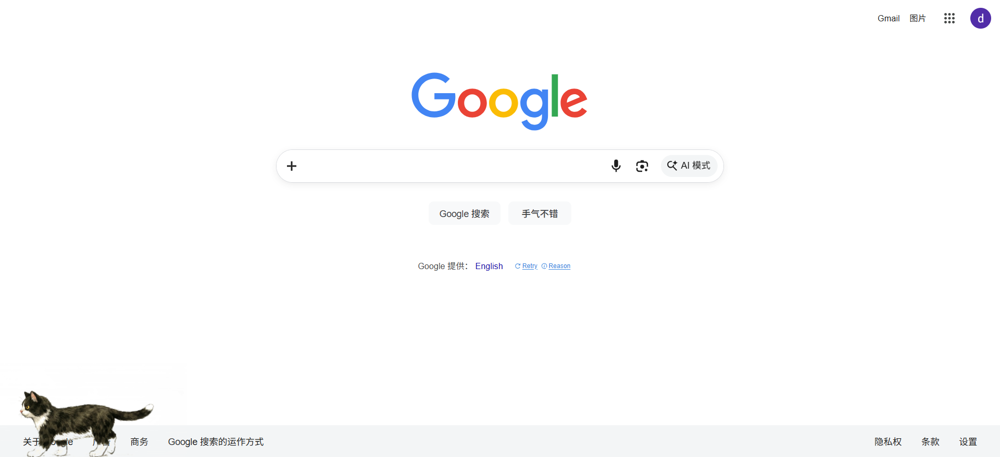
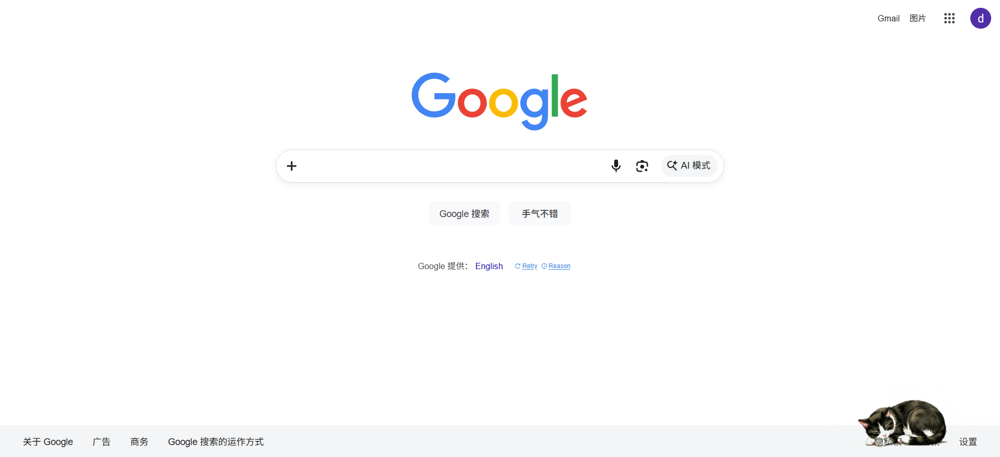
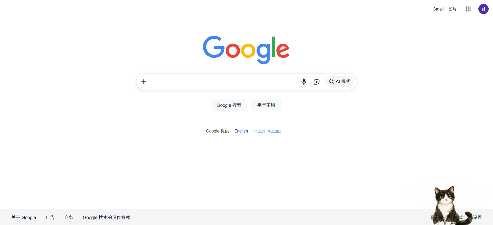
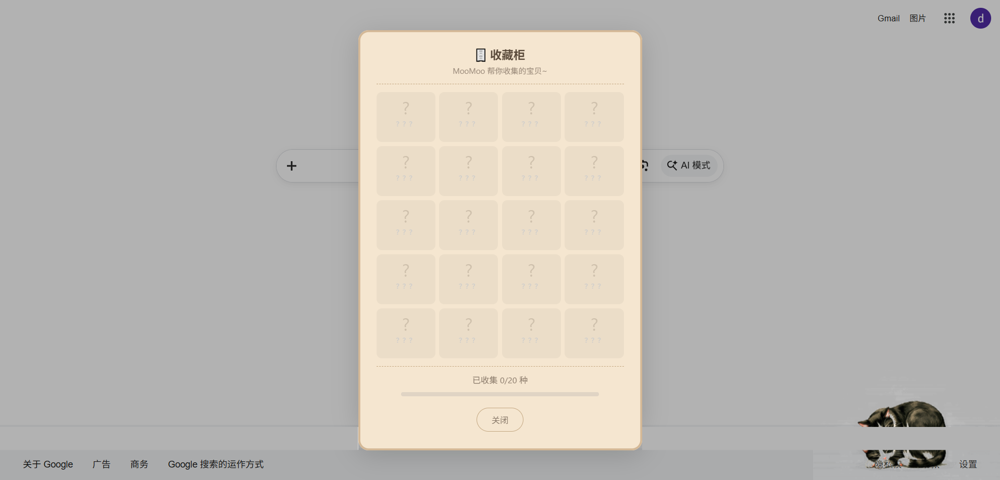
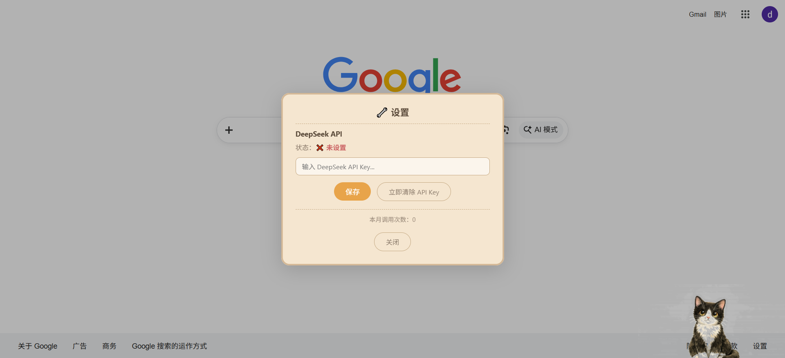

[English](README_EN.md) | 中文

# 🐱 MooMoo — 你的浏览器奶牛猫小伙伴

一只住在浏览器角落里的奶牛猫。

她不会监督你工作，不会弹出提醒催你喝水，也不会帮你管理待办事项。她只是安安静静待在那里——偶尔走两步，偶尔趴下来打个盹，偶尔给你叼来一封信。

在你对着屏幕的那些漫长时间里，她是一点活生生的、柔软的存在。

MooMoo 是一个 Chrome 浏览器扩展，以日式手绘水墨风格绘制。她有自己的小日子：早上伸懒腰、中午吃饭、下午追蝴蝶、深夜缩成一团睡觉。你不用管她，她就在那里，陪着你。

---

## 她会做什么？

### 🎨 22 组手绘动画

走路、睡觉、伸懒腰、打哈欠、吃饭、喝水、舔毛、追蝴蝶、被逗猫棒吸引、葛优瘫、四仰八叉、打滚、被吓一跳……每一组动画都是先由 AI 生成视频，再逐帧提取出来的——所以她的动作是真的在「动」，不是几张图切来切去。

### ⏰ 她知道现在几点

早上她会伸懒腰打哈欠，中午去吃饭喝水，下午精力旺盛追蝴蝶玩球，到了深夜就安静地睡觉。不是死板的时刻表，更像是一种倾向——她有自己的随机性，你永远不知道她下一秒会干什么。

就像真的猫一样，她有自己的节奏。而这种不受控的小生命感，恰恰是让人觉得温暖的地方。

### 💛 你们的关系会慢慢变好

刚装上的时候，MooMoo 还不认识你。你点她，她会吓一跳往后缩。但只要你每天都打开浏览器，她会慢慢放下戒备，开始对你说话，最后甚至愿意在你面前翻肚皮。

这个过程没有任何操作，不需要你做任何事——只是时间在走，信任就在长。就像现实中和一只猫的关系一样，急不来，但回头看的时候，你会发现一切都在悄悄变化。

| 阶段 | 大概时间 | 她会怎样 |
|------|----------|----------|
| 🐱 陌生期 | 前两周 | 小心翼翼，点她会受惊 |
| 👀 好奇期 | 第 3-4 周 | 偶尔冒出「?」「...」，在观察你 |
| 😺 熟悉期 | 第 2-3 个月 | 开始说「喵~」，不怕你了 |
| 💛 亲密期 | 第 3 个月 | 会主动跟你打招呼 |
| 🌟 快乐伙伴 | 第 3 个月之后 | 完全信任你，给你看肚皮 |

### 📬 每周一封小挑战

每周一，MooMoo 会叼来一封信。打开是一个随机的小挑战——

> 🍹 「尝试一种你从没喝过的饮料，拍张照片记录感受」
>
> 💌 「给 10 年后的自己写一封短信」
>
> ☁️ 「学习辨认三种不同类型的云」

这些挑战不是 KPI，没有分数，没有排行榜。它们只是一些小小的推力，让你从屏幕前抬起头来，往日常生活里多看一眼。你可以接受、完成后写一句感想；也可以跳过，没有任何惩罚。

如果你配置了 DeepSeek API，挑战内容会由 AI 动态生成，每次都不一样。没配也完全没关系，MooMoo 自带 55 条精心写好的挑战。

### 📊 每月浏览小报告

MooMoo 会默默记住你每天都在逛哪些网站（只记域名，不记具体页面，不上传任何数据）。每月 1 号，她会叼来一封月度报告，让你看看上个月的时间都花在哪里了。

不是为了让你焦虑，只是帮你看见自己。

### 🗄️ 收藏柜

随着你们关系加深，MooMoo 偶尔会叼来一些小东西送给你——一片落叶、一根羽毛、一只蝴蝶、一颗星星……共 20 种收藏品，分为普通、少见、稀有、传说四个等级。右键点击 MooMoo 可以打开收藏柜看看你攒了多少。

每一件都是她出门溜达捡回来的，小猫的心意。

### 🔧 DeepSeek API（可选）

右键点击 MooMoo → 设置，可以输入你的 DeepSeek API Key。配置后每周挑战会由 AI 动态生成。没有 Key 也不影响任何功能。

API Key 仅存储在浏览器会话（session）中，关闭浏览器就自动清除，不会上传到任何地方。

---

## 📦 怎么安装？

MooMoo 还没上架 Chrome 应用商店，需要手动安装，很简单：

1. 点击本页面右上角绿色的 **Code** 按钮 → **Download ZIP**
2. 解压到一个你能找到的文件夹
3. 打开 Chrome，地址栏输入 `chrome://extensions/`
4. 打开右上角的 **开发者模式**
5. 点击 **加载已解压的扩展程序**，选刚才解压的文件夹

装好之后打开任意网页，右下角就能看到她了 🐱

---

## 🎨 为什么做这个？

我们每天花大量时间盯着屏幕。工作、学习、刷信息流——这些时间里，屏幕是冰冷的，机械的，功能性的。

我想在这片冰冷里放进一点点活着的东西。

MooMoo 不是效率工具，不是 AI 助手，不是任何需要你「使用」的东西。她就是一只猫，按自己的节奏过日子。你忙你的，她待她的。你偶尔低头看一眼，发现她在睡觉，就觉得安心了。

她没办法帮你完成工作，但也许能让你在面对屏幕的那些时间里，感受到一丝丝温度。

这就够了。

---

## 🛠️ 技术相关

- 纯原生 JavaScript，没有任何框架
- Chrome Extension Manifest V3
- 动画素材：[可灵 AI（Kling）](https://klingai.com/) 图生视频 → Python 逐帧提取
- 参考图：Microsoft Copilot（DALL-E 3）
- AI 挑战生成：[DeepSeek API](https://platform.deepseek.com)（可选）

---

## 📝 License

[MIT](LICENSE) — 随便用，开心就好。

---

> 她不会改变你的生活。但在你对着屏幕的那些时间里，角落里有一只猫在陪着你，这件事本身，就在悄悄滋养着什么。🐱🖤🤍
